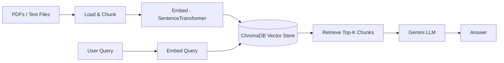
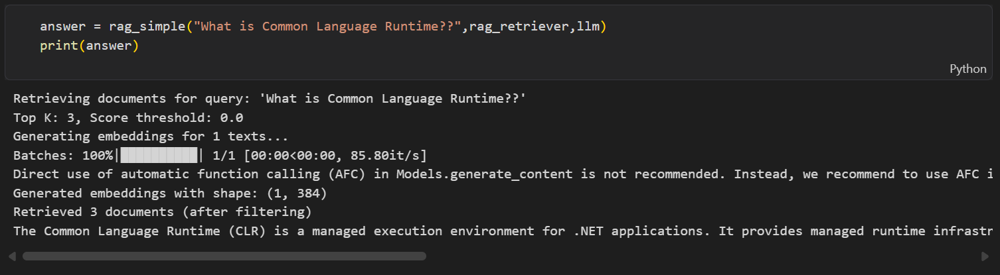

# RAG Project

A Retrieval-Augmented Generation (RAG) pipeline that ingests documents (PDFs and text files), embeds them into a vector database, retrieves relevant context for a query, and generates answers using Google's Gemini LLM.

## How it works

The pipeline is built and demonstrated across two Jupyter notebooks in [notebook/](notebook/):

1. **Data ingestion** ([notebook/document.ipynb](notebook/document.ipynb))
   - Loads plain text files with `TextLoader` (see [data/text_files/python_intro.txt](data/text_files/python_intro.txt) and [data/text_files/machine_learning.txt](data/text_files/machine_learning.txt)).
   - Loads PDFs in bulk from [data/pdfs/](data/pdfs/) using `DirectoryLoader` + `PyMuPDFLoader`.

2. **Chunking, embedding, retrieval and generation** ([notebook/pdf_loader.ipynb](notebook/pdf_loader.ipynb))
   - **Load** all PDFs from `data/` with `PyPDFLoader`, tagging each document with its source filename.
   - **Split** documents into overlapping chunks using `RecursiveCharacterTextSplitter` (`chunk_size=1000`, `chunk_overlap=200`).
   - **Embed** chunks with the `sentence-transformers` model `all-MiniLM-L6-v2` (`EmbeddingManager`).
   - **Store** embeddings in a persistent [ChromaDB](https://www.trychroma.com/) collection on disk at `data/vector_store/` (`VectorStore`).
   - **Retrieve** the top-k most similar chunks for a query using cosine similarity over the stored embeddings (`RAGRetriver`).
   - **Generate** a final answer by feeding the retrieved context into `gemini-2.5-flash` via `langchain-google-genai` (`rag_simple`).



## Project structure

```
RAG-Project/
├── main.py                          # Entry point stub
├── pyproject.toml                   # Project metadata & dependencies (uv)
├── requirements.txt                 # Dependencies (pip)
├── .env.example                     # Template for required environment variables
│
├── data/
│   ├── pdfs/                        # Source PDF documents
│   ├── text_files/                  # Sample plain-text documents
│   └── vector_store/                # Persisted ChromaDB collection (generated, gitignored)
│
├── notebook/
│   ├── document.ipynb                # Data ingestion basics (text + PDF loaders)
│   └── pdf_loader.ipynb              # Full pipeline: chunk -> embed -> store -> retrieve -> generate
│
├── docs/
│   └── assets/                       # Images used in this README
│
└── src/                              # Reserved for reusable pipeline modules
```

| Path | Purpose |
|---|---|
| `data/pdfs/` | Drop source PDFs here to be ingested |
| `data/text_files/` | Plain-text sample documents |
| `data/vector_store/` | ChromaDB persistence directory, rebuilt from `data/` — not committed |
| `notebook/document.ipynb` | Minimal example of loading text & PDF documents |
| `notebook/pdf_loader.ipynb` | End-to-end RAG pipeline: chunk → embed → store → retrieve → generate |
| `src/` | Placeholder for extracting notebook logic into reusable modules |

## Tech stack

- [LangChain](https://www.langchain.com/) (`langchain`, `langchain-community`, `langchain-core`) — document loaders, text splitting, orchestration
- [langchain-google-genai](https://python.langchain.com/docs/integrations/chat/google_generative_ai/) — Gemini LLM integration
- [sentence-transformers](https://www.sbert.net/) — text embeddings (`all-MiniLM-L6-v2`)
- [ChromaDB](https://www.trychroma.com/) — persistent vector store
- [pypdf](https://pypi.org/project/pypdf/) / [PyMuPDF](https://pymupdf.readthedocs.io/) — PDF parsing
- [python-dotenv](https://pypi.org/project/python-dotenv/) — environment variable management

## Setup

### Prerequisites
- Python >= 3.14
- A [Google Gemini API key](https://ai.google.dev/)

### Install dependencies

Using [uv](https://docs.astral.sh/uv/) (recommended, see [pyproject.toml](pyproject.toml) / [uv.lock](uv.lock)):

```powershell
uv sync
```

Or with pip:

```powershell
pip install -r requirements.txt
```

### Configure environment variables

Copy the example file and add your own Gemini API key:

```powershell
cp .env.example .env
```

Then edit `.env`:

```
GEMINI_API_KEY="your-gemini-api-key-here"
```

`.env` is gitignored and should never be committed.

## Usage

1. Add your source documents to `data/pdfs/` (PDFs) or `data/text_files/` (plain text).
2. Open [notebook/pdf_loader.ipynb](notebook/pdf_loader.ipynb) in Jupyter/VS Code and run the cells top to bottom to:
   - build the vector store from your documents, and
   - ask questions against it, e.g. `rag_simple("What is Common Language Runtime?", rag_retriever, llm)`.
3. The vector store persists to `data/vector_store/` so it doesn't need to be rebuilt every run (delete that folder to start fresh).

### Example output



## Notes

- The vector store (`data/vector_store/`) is generated locally from the documents in `data/` and is excluded from version control — regenerate it by re-running the ingestion notebook.
